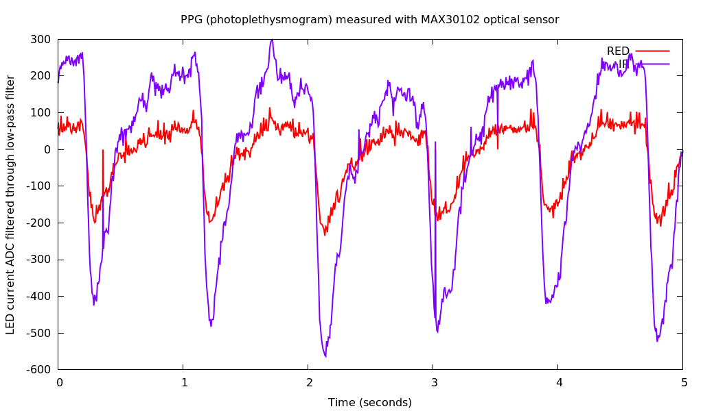

# LPC824_MAX30102

A simple UART interface to MAX30102 SPO2 sensor mounted on a breakout board (part GY-MAX30102) using NXP LPC824 MCU.

Test PPG (photoplethysmogram) measured with MAX30102 optical sensor on thumb.

=======

## 23 July 2017, version 0.1

* Support two MAX30102 sensors. Since the sensor has a fixed address they cannout share
the same I2C bus. Using I2C0 and I2C1. Up to 4 sensors can be supported this way.
* Known issue: can hang in an infinite loop while waiting for I2C (presumably due to 
bus error). Need to timeout I2C reads or implement watchdog timer to reset.

Status: work in progress.

A simple UART interface to MAX30102 SPO2 sensor mounted on a breakout board (part GY-MAX30102) using NXP LPC824 MCU. 

The Maxim MAX30102 sensor uses 1.8V for digital logic and 3.1 - 5.25V for LED drive. To use with 3.3V/5V MCUs or dev boards like Arduino, a linear regulator is needed for MAX30102 sensor supply rails and level convertors for I2C SDA/CLK lines.

## GY-MAX30102

Marked as "GY-MAX30100" on PCB. Cannot find schematic. PCB incorporates LDO and level converters. Can operate at 3.3V to 5V.
INT pin needs pull up resistor (either external or enabled within the MCU).

Breakout board components

* "662K" 3.3V LDO (presumably for LED driver)
* "65K5" 1.8V LDO  (for digital logic)
* "702" 60V N-channel enhancement mode MOSFET (as logic level convertor)

Using FET for level shifting:

AN97055 Bi-directional level shifter for I²C-bus and other systems.
https://cdn-shop.adafruit.com/datasheets/an97055.pdf

Datasheets:

http://www.mikrocontroller.net/attachment/193855/LM6206N3.pdf
http://www.s-manuals.com/pdf/datasheet/2/n/2n7002dw_panjit.pdf
https://datasheets.maximintegrated.com/en/ds/MAX30102.pdf

Papers:

[An Automatic Beat Detection Algorithm
for Pressure Signals](./doc/BeatDetection.pdf)

